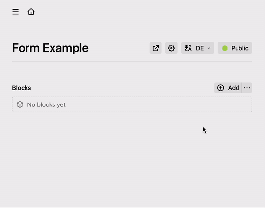
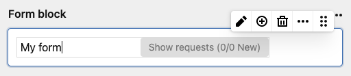

# Kirby Form Block Suite

## Overview

This form plugin for Kirby offers you maximum flexibility and usability.
It can be used as a block anywhere you needed. Even multiple times per page.
With the integrated mailview field you can display requests allover the panel.




**Packed with a rich set of features:** 🎉

⭐️ &nbsp; Editors can flexibly organise the form fields.

⭐️ &nbsp; Spam protection with an integrated honeypot.

⭐️ &nbsp; Create a custom form field easely by added with just 2 files (Blueprint & Template).

⭐️ &nbsp; A newly created form block will be automatically filled by default data from a JSON file (which you can copy from a existing form block).

⭐️ &nbsp; Incoming requests can be viewed and managed within the block or with the mailview field. (optional)

⭐️ &nbsp; You and/or the visitors will receive an email on incoming requests. (If desired)

⭐️ &nbsp; Custom form data can be defined in the config file. (E.g. for using of the IP address, etc.).

⭐️ &nbsp; Language support for English and German. Messages are fully customizable/expandable for developers and/or editors.

## Version 3.0

### New features

This repository is the successor of the popular Kirby Form Block with a lot of new features:

⭐️ &nbsp; Fileupload!

⭐️ &nbsp; Send form without reloading the page.

⭐️ &nbsp; Mailview field can be used everywhere and shows all reqeusts from subpages clearly grouped.

⭐️ &nbsp; Bugfixes, performance improvement and many tiny extras.

⭐️ &nbsp; Downward compatible.

### Buy a license

> **This Plugin is no longer free to use.**
>
> **You can test this plugin for 14 days and then purchase a license key [here](https://license.microman.ch/?product=801346).**

A license key can be used for one Kirby instance. Enter your license key into the config file:

```php
'microman.formblock.license' => "[your-key]",
```


### Migration information

This Plugin _should_ be compatible with the Kirby Form Block v2.0.

For a secure migration please follow these steps:

1. Make a backup! No liability for data loss!
2. Delete the folder of the perview kirby form block plugin.
3. If you modified `form.php`, copy the same from the plugin and edit it accordingly.


## Installation

For use with Kirby 3.8+ only! ([update here!](https://github.com/getkirby/kirby))
Download and copy this repository to your plugin folder: `/site/plugins/`

**Composer**

`composer require microman/kirby-form-block-suite`

## Form Block

Just put `form` in your fieldsets of your blocks field:

```yml
fields:
  my_block:
    type: blocks
    fieldsets:
      - form
      ...
```

If you're not familar with Kirbys blocks field [check this out](https://getkirby.com/docs/reference/panel/fields/blocks).

Inside the blocks settings you have 3 tabs:

- *Inbox:* Contains the [Mailview field](#mailview-field) for the current form block.
- *Form fields* Manage the form fields that will displayed to the visitors. You can add more types of form fields. (more later)
- *Options* Sets the behavior on receipt of the request. Can be extended this with other fields

### Define default form block data

If your editor use more or less the same form multiple time, it can be usefull to set the default setting.
To define the default form fields and form options follow these steps:

1. Create a form block
2. Fill it as desiered
3. Copy the form block
4. Paste it into `site/config/formblock_default_[language_code].json`

Set the default language in the [config settings]

### Customize the Output
Quick and easy: Copy `site/plugins/kirby-form-blocks/snippets/blocks/` to `site/snippets/blocks/` and edit the files.

## Form field types

### Available by default

|  | Name   |  Output |
|:-:|:-|:-------------|
|1|input| |
|2|textarea| |
|3|select| |
|4|radio| |
|5|checkbox| |
|6|file | |

> **Note for attachment field type:**
>
> - To increase the maximum file size set the `upload_max_filesize`, `post_max_size` and `memory_limit` to desiered value in your php.ini.

### Add a custom form field types

Let's say you want to create an form field that shows some information to your visitors:

_site/blueprints/blocks/formfields/info.yml_
```yml
name: Information
icon: alert

fields:
  title:
    type: text
    width: 1/2
  color:
    type: select
    width: 1/2
    options:
      green: Green
      orange: Orange
      red: Red
  info:
    label: form.block.fromfields.select.placeholder
    type: writer
```

_site/snippets/formfields/info.php_
```xml
<div class="info-field" id="<?= $formfield->slug() ?>" style="background:<?= $formfield->color() ?>">
    
    <?php if($formfield->title()->isNotEmpty()): ?>  
        <h3><?= $formfield->title() ?></h3>
    <?php endif ?>

    <?= $formfield->info() ?>

</div>
```

Et voilà. You just created a new form field type:


> To sort the fields in panel, you can use prefix like `05_fieldname` on blueprints filename. Default fields stays on top.

### Modify/disable default form field types

Just copy `site/plugins/kirby-form-field/blueprints/blocks/formfields` to `site/blueprints/blocks/formfields` and edit it.

> To disable a default form field type, just remove the content of the file.

### Extend custom fields in form fields

Each form field has by default following fields:

|  Name |   Description |
|:-------|:-------------|
| Display name | Used for labels |
| Unique identifier | It's required to work with fields.|
| Context | Defines the kind of input. Is needet for autocompletition and the spam protection.
| Required | The visitor must fill this field

> Make shure that the unique identifier is only just once used in the whole form block!

Let's make an example and adding a field for the width:

_site/blueprints/blocks/customfields.yml_
```yml
width:
  label: Width
  type: select
  options:
    col-12: "1/1"
    col-6: "1/2"
    col-4: "1/3"

```

_Output:_
```xml
<?php foreach ($form->fields() as $field) : ?>

  <div class="<?= $field->width() ?>">

    <?= $field->toHtml() ?>

  </div>
<?php endforeach ?> 
```

## Messages

- Messages are text fragments, that is used in the frontend or in notify/confirmations emails.
- You can use messages manually in your code like this: `$form->my_message()`.
- Use Placeholder in messages like this `Dear {{title}} {{name}}`. Read more about [placeholders](#placeholders).
- For single language page please set the default language in the [config](#translations)
- Available messages can be found in `index.php` of this pluginfolder under _options.translations_. DO NOT EDIT THEM THERE! There are 3 ways to change/add messages (in order of priority):

1. Copy an modify translation files `site/plugins/kirby-form-field/lib/languages/*.php` -> `form.block.*`
2. [In the config with translations](#translations)
3. Let the editor decide: Use a custom field in the option tab:
 
To modify fields in the option tab, copy `site/plugins/kirby-form-field/blueprints/snippets/form_options.yml` to `site/blueprints/snippets` and edit it:

```xml

nvalid_message:
  label: Custom success message
  type: writer
  help: form.block.default.help

my_custom_message:
  label: Custom Message
  type: writer


```

> There are also `form_confirm.yml` and `form_notify.yml` in that snippets folder. DO NOT modify them! Better disable the underlying function [in the config](#disable-functions).

## Object

### Form Object

The form object provides you with a few useful methods that help you to work with the form block: (e.g. `$form->showForm()`)

|  Method |   Description | Parameter |
|--|:-------------|--|
| showForm | Returns `true` if the form is ready to fill  | (None) |
| fields | Returns an array of all form fields. | *\$attrs:* Array or string of desired Attibutes (e.g. 'label' returns the title of the field)<br/>(none) returns the [form field object](#form-field-object) |
| fieldsWithPlaceholder | Returns an array of all form field with [placeholders](#placeholders). | *\$attrs:* Array or string of desired Attibutes (e.g. 'label' returns the title of the field)<br/>(none) returns the [form field object](#form-field-object) | 
| field | Returns a form fields by unique identifier | *\$slug:* unique identifier of the field<br />*\$attrs:* Array or string of desired Attibutes (e.g. 'label' returns the title of the field)<br/>(none) returns a [form field object](#form-field-object) |
| isFilled | Returns `true` if the visitor send the form | (None) |
| isValid | Returns `true` if the visitor filled the form correctly | (None) |
| isFatal | Returns `true` if something went terribly wrong | (None) |
| isSuccess | Returns `true` if the request was successfully send | (None) |
| errorFields | Returns as list or array of invalid form fields  | *\$separator:* Char to Separate the field names. <br/>(none) returns an array |
| message | Returns a message | *\$key:* Key of the Text<br />*\$replaceArray:* Assotiative array with additional Placeholder. |
| errorMessage | Returns error Message if `isFatal` | (None) |
| successMessage | Returns success Message if `isSuccess` | (None) |
| sendNotification * | Send Email to operator<br />([if notify enabled](#disable-functions))    | *\$body:* Content of the Email<br />*\$recipient:* Email to send to (optional) |
| sendConfirmation * | Send Email to visitor<br />([if confirm enabled](#disable-functions))    | *\$body:* Content of the Email<br />*\$reply:* Email that the visitor can answere (optional) |
| setError | Brings the form to state `isFatal` | *\$error:* Error message<br />*\$save:* If `true` the request will saved in the Inbox  |


> \* Use only if you like to send extra emails. By default, the emails are sent automatically by the plugin after successful completion. 

### Form Field Object

|  Method |   Description | Parameter |
|--|:-------------|--|
| * | Returns the field from the formfield.<br/> (e.g `$field->custom_field()`) | (None) |
| value | Value from form data or default value | *\$raw*: `true`...<br/> ...returns the value without HTML escaping<br/>...with Options: returns the slug (not the Label)  |
| label | Display Name | (None) |
| slug | Unique identifier | (none) |
| files | Returns an array of the files| *\$key*: Desired attribute of the $_FILES-Object (name, type, tmp_name, error, size) <br />*\$item:* Index of the file  |
| autofill | Context for autocompletition | *\$html:* <br/>(none) returns bool<br/> `attr` returns ' autocomplete="my_context"' |
| required | return true or expression if field is required | *\$html:* <br/>(none) returns bool<br/>`asterisk` returns ' * '<br/>`attr` returns ' required' 
| type | Returns the field type | (none) |
| isFilled | Returns true if the form field is not empty | (none) |
| isValid | Returns true if the form field is filled correctly | (none) |
| errorMessages | Returns an array of all errors, if invalid. | (none) |
| errorMessage | Returns one errors, if invalid. | (none) |
| hasOption | Returns `true` if the form type is:<br/>checkbox, radio or select |(none) |
| selectedOptions | Returns array of selected options | *\$prop:* Desired property. Default = Value |
| options | Returns a structure field with the options | (none) |
| ariaAttr | Returns the aria-attribute. (For invalid fields) | (none) |

## Config

### Email adress for outgoing emails

```php
'microman.formblock' => [
    'from_email' => 'info@example.com'
],
```
Default: `no-reply@[the root url of your website]`

> If the domain is differ from the website domain [check the DMARC](https://de.wikipedia.org/wiki/DMARC) to ensure that the emails will not rejected.

> You probably get an SMTP-Error on localhost environments. Test the email function on a server!

### Placeholders

In addition to the incoming form data, extra placeholders can be defined. (Which can be used with `{{}}` in your messages)
For example, to determine the IP address of the sender:

```php
'microman.formblock' => [
  'placeholders' => [
    'ip' => [
      'label' => "IP address",
      'value' => function ($fields) {
        return $_SERVER['REMOTE_ADDR'];
      }
    ]
  ]
],
```

### Disable Functions

Functions like _request saving_, _notification email_ or _confirmation email_ can be disabled:

```php
'microman.formblock' => [
  'disable_inbox' => true,
  'disable_confirm' => true,
  'disable_notify' => true,
],
```

The corresponding function will be no longer executed and in the panel the tab/fields won't be visible anymore.

### Dynamic validation

Since Version 3.0 the form is validate dynamicly (No reload of the page on submit). You can disable this function like this:

```php
'microman.formblock' => [
  'dynamic_validation' => false,
],
```

### Verify Content

To ensure that the visitor does not submit the form more than once (for example by refreshing the page), this Plugin checks whether a form with the same content has been submitted already. In this case, an error message is shown to the visitor.

By default this function is disabled. To activate it use following syntax:

```php
'microman.formblock' => [
  'verify_content' => false,
],
```

### Translations

If your site is **not** multilingual, set the default language:

```php
'microman.formblock' => [
  'default_language' = 'de'
]

```
> Multilingual sites will applied the current language.

Change custom texts like this:

```php
'microman.formblock' => [
  'translations' => [
    'en' => [
        'success_message' => 'Your beautiful request has been sent.'
    ],
    'de' => [
        'success_message' => 'Deine wunderschöne Anfrage wurde versendet.'
    ]
  ]
],
```
[See chapter Messages](#messages) for more information.

### Mailview field

You can use the mailview field to show all requests of subpages.


Feature:

- Nice overview of new & readed requests
- See all incomming requests and set it to read/unread or delete it.
- By clicking on a request, it will show all form data the visitor entered.
- Each forms are grouped in accoredons. The state of the accoredon will be memorized

For a clearly overview name your form blocks:



> ☝️ Be carefull! Deleting form blocks will also deleting all requests of this form block without promting!


## Conclusion

If you have any questions or something is not working properly, [please let me know](https://github.com/youngcut/kirby-form-block-suite/issues).

Hope you will enjoy this plugin. Stay tuned!
