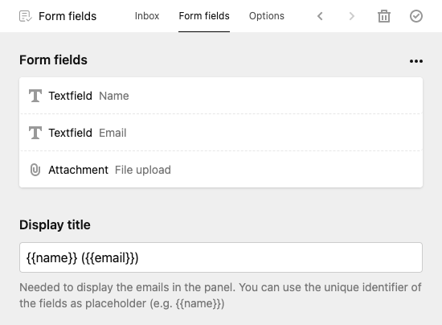
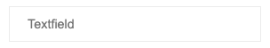
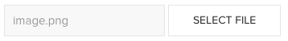
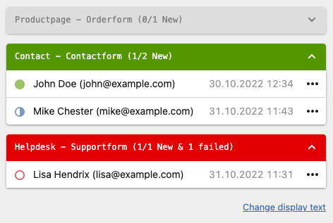
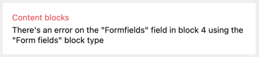

# Overview

This form plugin for Kirby offers you maximum flexibility and usability.
It can be used as a block anywhere you were needed. Even multiple times per page.
With the integrated mailview field you can display requests allover the panel.


**Packed with a rich set of features:** 🎉

⭐️ &nbsp; Editors can flexibly organize the form fields.

⭐️ &nbsp; Quick form validation without reloading the page (Even during fill in).

⭐️ &nbsp; Incoming requests can be viewed and managed within the block or with the mailview field. (included uploaded files)

⭐️ &nbsp; You and/or the visitors will receive an email on incoming requests.

⭐️ &nbsp; All the default text elements (include mail template) can be changed in the config or in the panel for each form.

⭐️ &nbsp; Multiple forms allowed per page.

⭐️ &nbsp; Templating for outgoing emails.

⭐️ &nbsp; Export forms as CSV (Since 5.1.0).

⭐️ &nbsp; Create a new form field type with ease by added just 2 files (Blueprint & Template).

⭐️ &nbsp; Spam protection with an integrated honeypot.

⭐️ &nbsp; Pre-styled form

⭐️ &nbsp; Full language support for English, German, Italian, French, Lithuanian, Hungarian & Netherlands

# Table of content

- [Overview](#overview)
- [Table of content](#table-of-content)
- [Installation](#installation)
- [How to use?](#how-to-use)
  - [Using the built-in styling](#using-the-built-in-styling)
- [Set up your form block](#set-up-your-form-block)
  - [Create a form block](#create-a-form-block)
  - [Set up your form fields](#set-up-your-form-fields)
  - [Define default form block data](#define-default-form-block-data)
  - [Mailview field](#mailview-field)
- [Advanced customizing](#advanced-customizing)
  - [Customize the output](#customize-the-output)
  - [Add a custom form field types](#add-a-custom-form-field-types)
  - [Modify/disable default form field types](#modifydisable-default-form-field-types)
  - [Extend custom fields in form fields](#extend-custom-fields-in-form-fields)
  - [Extend options](#extend-options)
  - [Messages](#messages)
- [Config](#config)
  - [Email address for outgoing emails](#email-address-for-outgoing-emails)
  - [Plain text emails](#plain-text-emails)
  - [Honeypot](#honeypot)
  - [Placeholders](#placeholders)
  - [Disable Functions](#disable-functions)
  - [Email templating](#email-templating)
  - [Translations](#translations)
  - [Dynamic validation](#dynamic-validation)
  - [Email field](#email-field)
  - [Hook Success](#hook-success)
  - [Hook Validate](#hook-validate)
- [Troubleshooting](#troubleshooting)
- [License](#license)


# Installation

**Manually**

[Download](https://github.com/plain-solutions-gmbh/kirby-form-block-suite/archive/refs/heads/main.zip) and copy the plugin into your plugin folder: `/site/plugins/`

**With Composer**

`composer require plain/kirby-form-block-suite`

**Get a license**

[Klick here to obtain a license](https://plain-solutions.net/?product=801346)

[See also the other plugins](https://plain-solutions.net/)

**Validate your license**

*Important notes: If you’re working in a development environment, please activate the license on the public domain. Licenses are tied to the domain they are first activated on.*

To validate your license key click on this button:


...or go to *System* in the Panel and click on `plain/formblock` in the Plugins section. (Kirby > 5.0.0). You’ll be guided through the validation process from there.

> If you have trouble with your license, check [Troubleshooting](#troubleshooting) at the end of this documentation.

# How to use?

Just create a block field in your blueprint and add `form` to the fieldsets props:

```yml
fields:
  my_block:
    type: blocks
    fieldsets:
      - form
```

Then output the block field in your templates with:

```php

<?= $my_block->toBlocks() =>

```

> If you're not familiar with the kirby block field, [check this out](https://getkirby.com/docs/reference/panel/fields/blocks).

## Using the built-in styling

For a quick start with nice-looking forms, we integrated a styling based on [BEM](https://en.bem.info/). No frameworks needed. Other forms will not be affected by this. 

To use the built-in styling, add the following line into the head element of your website before your styling: `<?= snippet('blocks/formcore/styles') ?>`

To change the default colors, add this lines to your stylesheed:

```css
:root {
    --formblock-color: #0d47a1;
    --formblock-color-invert: #fff;
    --formblock-color-error: #CC0000;
    --formblock-color-success: #007E33;
}
```

# Set up your form block

## Create a form block

After inserting a form block, you can **set a name** for your form.

By clicking on the **Show requests** button, a drawer is open with following tabs:

- **Inbox:** Contains the Mailview field for the current form block.
- **Form fields:** Manage the form fields that will be displayed to the visitors. You can add more types of form fields. (more later)
- **Options:** Sets the behavior of the form. This can also be used for custom settings.

## Set up your form fields

In the **form field** tab, you will find all your fields that's shown in the form. You can add more by clicking on **add** in the menu of the three dots.



The placeholders in **Display title** is taken from the data the visitor enter into the form. You can also use some [extra placeholders](#placeholders).

> Remember:
>
> - Every form field needs a unique identifier. Make sure, that each id is used once. Even the ids of the options entry. Otherwise the submit cause failture.

**Available form field types by default**

|  | Name   |  Output |
|:-:|:-|:-------------|
|1|Input| |
|2|Textarea| |
|3|Select| |
|4|Radio| |
|5|Checkbox| |
|6|Attachment | |
|7|Captcha | |

> **Note for attachment field type:**  To increase the maximum file size set the `upload_max_filesize`, `post_max_size` and `memory_limit` to desiered values in your php.ini.

## Define default form block data

If you add a new **form block**. A custom sets of form fields and options will be attached.
To change this, follow these steps:

1. Create a form block
2. Fill it as desired
3. Copy the form block
4. Paste it into `site/config/formblock_default_[language_code].json`


## Mailview field

You can use the mailview field to show all requests of the current and the subpages.



To use the mailview field, insert the following into your blueprint:

```
mailview:
  label: My form requests
  type: mailview

```


Feature:

- Nice overview of new & read requests
- See all incoming requests and set it to read/unread or delete it.
- By clicking on a request, it will show all form data the visitor entered.
- Each of the forms are grouped in accordions. The state of the accordion will be memorized

For a clear overview, name your form blocks.

> ☝️ Be carefull! Deleting form blocks will also deleting all requests of this form block without promting!


# Advanced customizing

## Customize the output

Quick and easy: Copy following files/folder from `site/plugins/kirby-form-blocks/snippets/blocks/` to `site/snippets/blocks/` and edit the files:

- **`form.php`**: Contains the modification instruction and the struct of your form
- **`/formtemplate`**: Holds the snippets of the form. You can add more and insert it with `<?= $block->template('your-snippet') ?>`
- **`/formfields`**: Here you can find the snippets of each [form field type](#form-field-types). To add a custom formfield following [this instruction](add-a-custom-form-field-types)

> See the comment inside `form.php` for important modification informations.

**Form Object**

The form object provides you a few useful methods that help you to work with the form block: (e.g. `$block->showForm()`)

|  Method |   Description | Parameter |
|--|:-------------|--|
| showForm | Returns `true` if the form is ready to fill  | (None) |
| fields | Returns an array of all form fields. | *\$attrs:* Array or string of desired attributes (e.g. 'label' returns the title of the field)<br/>(none) returns the **form field object** |
| templates | outputs a snippet contains in the `snippets/blocks/formtemplates` folder. | *\$template:* Name of the snippet<br/>*\$props:* Array of additional variables you can access with `$props["key_of_your_prop"]` |
| fieldsWithPlaceholder | Returns an array of all form field with [placeholders](#placeholders). | *\$attrs:* Array or string of desired attributes (e.g. 'label' returns the title of the field)<br/>(none) returns the [form field object](#form-field-object) | 
| field | Returns a form field by unique identifier | *\$slug:* unique identifier of the field<br />*\$attrs:* Array or string of desired attributes (e.g. 'label' returns the title of the field)<br/>(none) returns a [form field object](#form-field-object) |
| attachmentFields | Returns an array of field slugs with type **file** | (none) |
| isFilled | Returns `true` if the visitor sends the form | (None) |
| isValid | Returns `true` if the visitor filled the form correctly | (None) |
| isFatal | Returns `true` if something went terribly wrong | (None) |
| isSuccess | Returns `true` if the request was successfully sent | (None) |
| errorFields | Returns as list or array of invalid form fields  | *\$separator:* Char to Separate the field names. <br/>(none) returns an array |
| message | Returns a message | *\$key:* Key of the Text<br />*\$replaceArray:* Assotiative array with additional Placeholder. |
| errorMessage | Returns error Message if `isFatal` | (None) |
| successMessage | Returns success Message if `isSuccess` | (None) |
| sendNotification * | Send Email to operator<br />([if notify enabled](#disable-functions))    | *\$body:* Content of the Email<br />*\$recipient:* Email to send to (optional) |
| sendConfirmation * | Send Email to visitor<br />([if confirm enabled](#disable-functions))    | *\$body:* Content of the Email<br />*\$reply:* Email that the visitor can answer (optional) |
| setError | Brings the form to state `isFatal` | *\$error:* Error message<br />*\$save:* If `true` the request will save in the Inbox  |


> \* Use only if you like to send extra emails. By default, the emails are sent automatically by the plugin after successful completion. 

**Form Field Object**

To get the form field object, use `$block->field('slug_of_the_form_field')` or iterate it with `foreach ($form->fields() as $field)`

|  Method |   Description | Parameter |
|--|:-------------|--|
| * | Returns the field from the formfield.<br/> (e.g `$field->custom_field()`) | (None) |
| value | Value from form data or default value | *\$raw*: `true`...<br/> ...returns the value without HTML escaping<br/>...with Options: returns the slug (not the Label)  |
| label | Display Name | (None) |
| slug | Unique identifier | (none) |
| files | Returns an array of the files| *\$key*: Desired attribute of the $_FILES-Object (name, type, tmp_name, error, size) <br />*\$item:* Index of the file  |
| autofill | Context for autocompletition | *\$html:* <br/>(none) returns bool<br/> `attr` returns  ' autocomplete="my_context"' |
| required | return true or expression if field is required | *\$html:* <br/>(none) returns bool<br/>`asterisk` returns ' * '<br/>`attr` returns  ' required' 
| type | Returns the field type | (none) |
| isFilled | Returns true if the form field is not empty | (none) |
| isValid | Returns true if the form field is filled correctly | (none) |
| errorMessages | Returns an array of all errors, if invalid. | (none) |
| errorMessage | Returns one errors, if invalid. | (none) |
| hasOption | Returns `true` if the form type is:<br/>checkbox, radio or select |(none) |
| selectedOptions | Returns array of selected options | *\$prop:* Desired property. Default = Value |
| options | Returns a structure field with the options | (none) |
| ariaAttr | Returns the aria-attribute. (For invalid fields) | (none) |


## Add a custom form field types

Let's say you want to create a form field type that shows some information to your visitors:

_site/theme/blueprints/blocks/formfields/info.yml_
```yml
name: Information
icon: alert

fields:
  title:
    type: text
    width: 1/2
  color:
    type: select
    width: 1/2
    options:
      green: Green
      orange: Orange
      red: Red
  info:
    label: form.block.fromfields.select.placeholder
    type: writer
```

_site/theme/snippets/blocks/formfields/info.php_
```xml
<div class="info-field" data-form="field" id="<?= $formfield->slug() ?>" style="background:<?= $formfield->color() ?>">
    
    <?php if($formfield->title()->isNotEmpty()): ?>  
        <h3><?= $formfield->title() ?></h3>
    <?php endif ?>

    <?= $formfield->info() ?>

</div>
```

> Make sure your element contains the attribute `data-form="field"`.

Et voilà. You just created a new form field type:


> To sort the fields in panel, you can use prefix like `05_fieldname` on blueprints filename. Default fields stays on top.

## Modify/disable default form field types

Just copy `site/plugins/kirby-form-field/blueprints/blocks/formfields` to `site/blueprints/blocks/formfields` and edit it.

> To disable a default form field type, just remove the content of the file.

## Extend custom fields in form fields

Each form field has by default the following fields:

|  Name |   Description |
|:-------|:-------------|
| Display name | Used for labels |
| Unique identifier | It's required to work with fields.|
| Context | Defines the kind of input. It is needed for autocompletion and the spam protection.
| Required | The visitor must fill this field

> Make shure that the unique identifier is only just once used in the whole form block!

Let's make an example and adding a field for the width:

_site/blueprints/blocks/customfields.yml_
```yml
width:
  label: Width
  type: select
  options:
    col-12: "1/1"
    col-6: "1/2"
    col-4: "1/3"

```

_Output:_
```xml
<?php foreach ($form->fields() as $field) : ?>

  <div class="<?= $field->width() ?>">

    <?= $field->toHtml() ?>

  </div>
<?php endforeach ?> 
```

## Extend options

To give more options to the editor, you can add/modify fields of the **options tab**. As you will see in the [next capture](#messages), you can give your editors here the ability to overwrite the default text blocks.

To modify fields in the option tab, copy `site/plugins/kirby-form-field/blueprints/snippets/form_options.yml` to `site/blueprints/snippets` and edit it:

```xml
invalid_message:
  label: Custom success message
  type: writer
  help: form.block.default.help

my_custom_message:
  label: Custom Message
  type: writer

```

You can do the same with `form_confirm.yml` and `form_notify.yml`. For example, if you like to give the opurtunity to set the reply adress, add these lines to `form_notify.yml`:


```xml
notify_reply:
  label: Reply
  type: email
  when:
    enable_notify: true
```

Same works for BCC and the confirmation email:
- `notify_bcc`
- `confirm_reply`
- `confirm_bcc`

To disable confirmation or notification use [the config](#disable-functions).

## Messages

- Messages are text fragments, that are used in the frontend or in notify/confirmations emails.
- You can use messages manually in your code like this: `$block->my_message()`.
- Use Placeholder in messages like this `Dear {{title}} {{name}}`. Read more about [placeholders](#placeholders).
- For single language page, please set the default language in the [config](#translations)
- There are 3 ways to change/add messages (in order of priority):

1. Copy a modify translation files `site/plugins/kirby-form-field/lib/languages/*.php` -> `form.block.message.*`
2. [In the config with translations](#translations)
3. Let the editor decide: Use a [custom field in the option tab](#extend-options):

**Available text blocks**

|  Name | Example |
|:------|:--------|
| fatal_message | Something went wrong.<br>Contact the administrator or try again later. |
| success_message | Thank you {{ name }}. We will get back to you as soon as possible. |
| invalid_message | Please check these fields: |
| exists_message | The form has already been filled in. |
| required_fail | This field is required. |
| file_accept | Only following file types are accepted: {{accept}}. |
| file_maxsize | File(s) must not be larger than {{ maxsize }}MB |
| file_maxnumber | No more than {{maxnumber}} may be uploaded. |
| file_required | Choose at least one File to upload. |
| file_fatal | Something went wrong with the upload. Error no.  {{ error }}. |
| notify_email | Name \<mail@domain.com\> |
| notify_from | {{ name }} \<{{ email }}> |
| notify_reply | {{ email }} |
| notify_subject | Request from website. |
| notify_body | {{ name }} send a request:{{ summary }} |
| confirm_to | {{ name }} \<{{ email }}\> |
| confirm_email | Name \<mail@domain.com\>  |
| confirm_reply | no-reply@domain.com |
| confirm_subject | Your request |
| confirm_body | Thank you for your request, we will get back to you as soon as possible. |
| send_button | Send |
| loading | Uploading ({{percent}}) |

# Config

## Email address for outgoing emails

```php
'plain.formblock' => [
    'from_email' => ["info@example.com" => "John Doe"]
],
```
Default: `no-reply@[the root url of your website]`. This is the backup email adress for following messages: `notify_email`, `notify_from` and `confirm_email`.

> If the domain is differ from the website domain [check the DMARC](https://de.wikipedia.org/wiki/DMARC) to ensure that the emails will not rejected.

> You probably get an SMTP-Error on localhost environments. Test the email function on a server!

## Plain text emails

By default the plugin will use HTML for the body of the confirm/notification emails.
You can disable it this way:

```php
'plain.formblock' => [
    'disable_html' => false
],
```
_Thanks to [felix](https://github.com/plain-solutions-gmbh/kirby-form-block-suite/pull/27)_

## Honeypot

The form block plugin insert a hidden honeypot field into the form to prevent bots to make a request. If a bot is filling this field, the request will fail. Each field has a context field. The plugin checks which context is in use and get the next available context from this array for the honeypot field.

You can change the order and the kind of context with this setting.

```php
'plain.formblock' => [
  'honeypot_variants' => ["email", "name", "url"]
],
```

## Placeholders

In addition to the incoming form data, extra placeholders can be defined. (Which can be used with `{{}}` in your messages)
For example, to determine the IP address of the sender:

```php
'plain.formblock' => [
  'placeholders' => [
    'ip' => [
      'label' => "IP address",
      'value' => function ($fields) {
        return $_SERVER['REMOTE_ADDR'];
      }
    ]
  ]
],
```

You can use placeholders everywhere (mails, text blocks, as display name) like this: `{{ip}}`

## Disable Functions

Functions like _notification email_ or _confirmation email_ can be disabled:

```php
'plain.formblock' => [
  'disable_confirm' => true,
  'disable_notify' => true,
],
```

The corresponding function will be no longer executed and in the panel the tab/fields won't be visible anymore.

## Email templating

You can set the templates for outgoing emails like this:

```php
'plain.formblock' => [
  'email_template_confirmation' => require kirby()->root('site') . '/templates/emails/confirmation.php',
  'email_template_notification' => `
    { name } has sent you a message
  `
],
```

## Translations

Change custom texts like this:

```php
'plain.formblock' => [
  'translations' => [
    'en' => [
        'success_message' => 'Your beautiful request has been sent.'
    ],
    'de' => [
        'success_message' => 'Deine wunderschöne Anfrage wurde versendet.'
    ]
  ]
],
```
[See chapter Messages](#messages) for more information.


## Dynamic validation

The form is validated dynamically (No reload of the page on submit). You can disable this function like this:

```php
'plain.formblock' => [
  'dynamic_validation' => false,
],
```

If you disable this function, you'il lose some features

- No validation during fill-in
- Attachments will be removed after sending (Visitor needs to add them again on failed validation)
- No upload process bar
- The form will not be centered after sending


## Email field

For the confirmation or the notification email it's nessaissary to have a field, that contains the visitors email adress. You can set the email field id like this:

```php
'plain.formblock' => [
  'email_field' => 'email',
],
```

If no field with this id is found, the plugin takes the first field with the field type ´email´.

## Hook Success

```php
'hooks' => [
  'formblock.success:after' => function (\Plain\Formblock\Request $request) {
      //Your code
  },
  
]
```

## Hook Validate

Triggers when a form field is validating.

`$errors`is an array of all occures errors. You can add or remove errors.

This example shows an error message on entering specific email adresses.

```php
'hooks' => [
  'formblock.validation:before' => function (string $slug, string $value, array $errors): array
  {
    if ($slug === 'email' && in_array($value, [ 'mail_1@spam.com', 'mail_2@spam.com' ])) {
      array_push($errors, "This is an invalid email adress.");
    }
    return $errors;
  }
]
```


# Troubleshooting

> DEPRECATION-WARNING: Option prefix changed since version 5.0.2 (old: micorman.* | new: plain.*)
> Please read this Chapter carefuly before you [open an issue](https://github.com/plain-solutions-gmbh/kirby-form-block-suite/issues). 

---

**Problem:** How do i use the form bock suite in my kirby environemt:

**Solution:** This plugin is a Kirby block. Please read [this manual](https://getkirby.com/docs/reference/panel/fields/blocks) carefully before you start.

---

**Problem:** The form will not send:

**Solution:** Remove the [custom templates](#customize-the-output) (in case you use it) and try again. If it still not working open the dev tools (F11) of your browser, and check the console. Make a screenshot for further support.

---

**Problem:** Uncaught TypeError (in dev tool console)

**Solution:** Some servers have problems resolving symbolic links. In this case, contact your hosting.
If it is impossible to activate symbolic links, copy the content of `site/plugins/kirby-form-block-suite/assets` to `media/plugins/plain/formblock`.

---

**Problem:** Got an error by saving the form in panel:



**Solution:** Make sure all your form fields has a unique identifier. (Click the wizard icon for autofill from display name)

---

**Problem:** The form is not translating to the right language?

**Solution:** Your site is **not** multilingual. Or Kirby don't know the language of the visitor. Set a default language manually:

```php
'plain.formblock' => [
  'default_language' => 'de'
]

```
> This will be ignored for multilingual sites.

---

**Problem:** Error to validate license key

**Solutions:**
- If you haven't got a license yet? Get a [license](https://plain-solutions.net/?product=801346).
- Your server needs a connection to the license server: [https://plain-solutions.net](https://plain-solutions.net)
- Your license key was already validated by another host: Send me [an email](mailto:kirby@plain-solutions.net) **with your license key** to release the assigment.
- Delete the license file `/site/config/.formblock_license` (if present) and try again. 

---

**Problem:** Problem with the validation

**Solutions:**
- Check if the symbolic link _media/plugins/plain/formblock/formblock.js_ is working properly.
- There's a [known](https://github.com/plain-solutions-gmbh/kirby-form-block-suite/issues/15) incompatibility issue with the _Ahmet Bora's Minify HTML compression plugin_. We working on a solution.

---

If you still have any questions or something is not working properly, [make an issue request on GitHub](https://github.com/plain-solutions-gmbh/kirby-form-block-suite/issues) or send me a [private message](https://plain-solutions.net/support).

**I hope you will enjoy this plugin.**

# License

By using this project, you agree to the terms and conditions outlined in our [Terms of Service](https://plain-solutions.net/terms). 

To acquire a license for this project, please visit our [Licensing Page](https://plain-solutions.net/801346).
